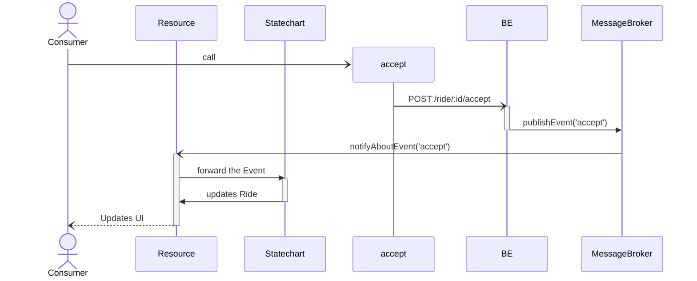
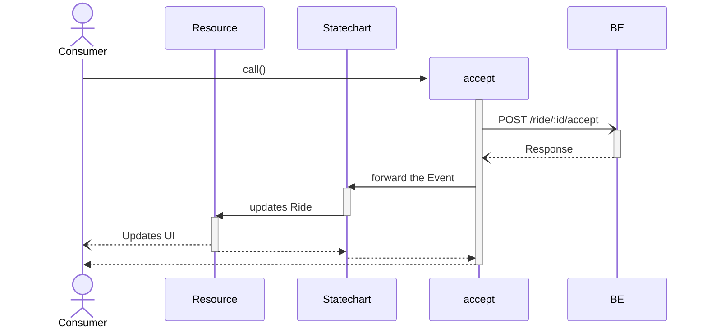
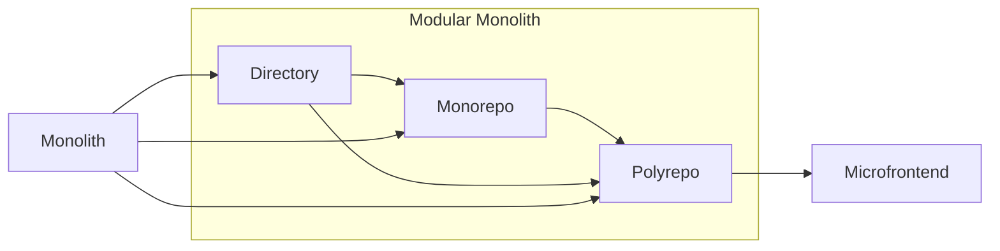

<!-- markdownlint-disable -->

# Scalable Frontend Architecture that meets Your Business

<div class="absolute bottom-10">
  <span class="font-700">
    Thomas Gossmann - 
    <a href="https://gos.si" target="_blank">gos.si</a> - 
    <a href="https://x.com/unistyler" target="_blank">@unistyler</a>
  </span>
</div>

<div class="absolute bottom-10 right-10">
  <span class="font-700">
    <a href="https://clark.io" target="_blank"></a>
  </span>
</div>

---
layout: center
---

# Architecture


Architects: Draw the map and guide engineers to the treasure<br>
Engineers: Read the map to reach the treasure

---

# Quiz: What does this Product do? (1)

<v-click>


</v-click>

---

# Quiz: What does this Product do? (2)


---

# Quiz: What does this Product do? (3)


---

# Default Directory Structure - Why ?

<v-clicks>

- Good onboarding to the framework
- Explains technical aspects of the framework

</v-clicks>

&nbsp;

<v-clicks>

- Good for hobby and weekend projects
- Hardly scalable beyond that

</v-clicks>


---
layout: section
---

### Part 1

# Meet Your Business

## Tactical Design

---
layout: two-cols
---

<div
  v-motion
  :initial="{ x: 500 }"
  :enter="{ x: -40, y: -40 }"
  class="font-size-10 absolute"
  v-click="3"
>
  <ph-magnet class="rotate-z-270 color-orange"/>
</div>

# Technical Objects

- Components
- Services
- Routes


<v-click>
<ph-arrow-elbow-left-up/> <i>not</i> aspects of your product
</v-click>


::right::

# Domain Objects

- Contract
- Appointment
- Risk Audit
- Saloon
- Calendar

<v-click>
<ph-arrow-elbow-left-up/> they <i><b>are</b></i> aspects of your product
</v-click>

---

# Why there is no Domain-Driven Development ?

It is hard to do. Some observed reasons:

<v-clicks depth="2">

1. Education: Data Structures, Algorithms, Design Patterns, Performance, ...
   - Missing: Linguistic Course, Domain-Driven Design Pratices
2. We design development workflows for technical aspects
3. No visibility for the domain in our code
   - Lack of feedback from product people or designers
   - No reward to engineers for their contributing impact

</v-clicks>

---
layout: statement
---

# Can we (Re)Design our Development Workflow with the Business in Mind?

---
layout: section
---

# 1. Identify Technical Aspects that Encode Business Logic

---
layout: two-cols
---

<div class="absolute text-center bottom-30px" v-click>

## Command-Query-Separation (CQS)

Functions to either be commands that perform an action or queries that respond data, but neither both!
</div>

# Queries

```ts
function query(...args: unknown[]): NonNullable<unknown>;
```

- _Read_
- Questions: Ask facts about the system
- Abilities/Authorization/Guards/Conditions/Criteria: Control acces

::right::

# Commands

```ts
function command(...args: unknown[]): void;
```

- _Write_
- Fire & Forget
- May/should cause side effects


---
layout: two-cols-header
---

# Queries: Presentation Logic / Control Flow

<p class="text-align-center">
  <ph-arrow-elbow-left-down/>
  Two Times Business Logic. Two Times Anti-Patterns
  <ph-arrow-elbow-right-down/>
</p>

::left::

<v-click>

## Helper

```gts
{{#if (feature-flag 'PROPLUS')}}
  Special Feature here
{{/if}}
```

</v-click>

<v-clicks at="3">

<ul class="absolute left-30px bottom-30px w-100">
  <li> What's the name of the feature?<br>
  <small>hint: it is not "Pro Plus", that's only the
  feature flag currently used for its condition</small></li>
  <li>Not unit testable :(</li>
</ul>

</v-clicks>

::right::

<v-click at="2">

## Components

```gts
import Component from '@glimmmer/component';
import { service } from '@ember/service';
import type FeaturesService from 'whereever/features-infra-sits';

class Search extends Component {
  @service declare features: FeaturesService;

  get isProPlus() {
    return this.features.has('PROPLUS');
  }

  <template>
    {{#if this.isPropPlus}}
      Special Feature here
    {{/if}}
  </template>
}
```

</v-click>

---

# Queries: Data Fetching

- Fetching data from your API
- Business logic part:
  - Endpoint
  - Parameters
  - Payload structure

---
layout: two-cols-header
---

# Commands: Actions

::left::

## Components

```gts
import Component from '@glimmer/component';
import { action } from '@ember/object'; 
import { AnotherComponent } from 'your-ui';

class Expose extends Component {
  @action
  onClick() {
    // whatever happens here
  }

  <template>
    <AnotherComponent @onClick={{this.onClick}}>
      Something sits here
    </AnotherComponent>
  </template>
}
```

::right::

## Services

```ts
import Service from '@ember/service';

class UserService extends Service {
  createUser(data) {
    // ...
  }

  deleteUser(userId: number) {
    // ...
  }
}
```

---

# Services

Services is an overloaded Term

<br>
<div class="grid grid-cols-[1fr_1fr_1fr]">
  <div v-click>
    <h2>Infrastructure Services</h2><br>
    <ul>
      <li>API client</li>
      <li>Messaging / Message Broker</li>
    </ul>
  </div>
  <div v-click>
    <h2>Application Services</h2><br>
    <ul>
      <li>Session</li>
      <li>Features</li>
      <li>A/B Testing</li>
    </ul>
  </div>
  <div v-click>
    <h2>Domain Services</h2><br>
    <ul>
      <li>Domain Objects (CRUD)</li>
      <li>e.g. UsersService</li>
    </ul>
  </div>
</div>

---
layout: fact
---

## We host Business logic in Components, Services, Routes, Controllers, Models merely to use Ember's DI system.
<br>

<v-click>

## We created a strong coupling of business logic to Ember's DI system 🤔
</v-click>

---
layout: two-cols-header
---

# What is the correct Statement?

::left::

<div class="text-center">

(A) <br>
Make a Framework a Dependency of your Business?

</div>

::right::

<div v-mark.circle.green class="text-center">

(B) <br>
Your Business drives Implementation within a Framework?

</div>

---
layout: section
---

# 2. (Re)Design our Development Workflow

---
layout: two-cols-header
---

# Rideshare Example

::left::

## On the Development of Reactive Systems with Ember.js

<br>

<Youtube id="bzkYV3AeYm4" />

by Clemens Müller and Michael Klein

::right::

## Domain Modeling Made Functional

<br>

<Youtube id="2JB1_e5wZmU" />

by Scott Wlaschin


---
layout: two-cols
transition: slide-left
---


::right::

```ts
interface User {
  id: string;
  name: string;
  type: 'rider' | 'driver';
}

type RideState = 
  | 'requested'
  | 'declined'
  | 'awaiting_pickup'
  | 'driving'
  | 'arrived'
  | 'payed'
  | 'canceled';

interface Ride {
  id: string;
  from: string;
  to: string;
  riderId: string;
  driverId: string;
  state: RideState;
}
```

---
layout: two-cols
---

```ts
interface User {
  id: string;
  name: string;
  type: 'rider' | 'driver';
}

type RideState = 
  | 'requested'
  | 'declined'
  | 'awaiting_pickup'
  | 'driving'
  | 'arrived'
  | 'payed'
  | 'canceled';

interface Ride {
  id: string;
  from: string;
  to: string;
  riderId: string;
  driverId: string;
  state: RideState;
}
```

::right::

```ts
// actions
function request(ride: Ride, rider: User): void;
function accept(ride: Ride, driver: User): void;
function drive(ride: Ride, driver: User): void;
function arrive(ride: Ride, driver: User): void;
function pay(ride: Ride, rider: User): void;
function cancel(ride: Ride, user?: User): void;

// guards rsp. abilities
function canRequest(ride: Ride, user: User): boolean;
function canAccept(ride: Ride, user: User): boolean;
function canDrive(ride: Ride, user: User): boolean;
function canDecline(ride: Ride, user: User): boolean;
function canArrive(ride: Ride, user: User): boolean;
function mustPay(ride: Ride, rider: User): boolean;

// questions
function isDriver(user: User): boolean;
function isRider(user: User): boolean;
function isDriverFor(ride: Ride, driver: User): boolean;
function calculateTravelDistance(ride: Ride): number;
```

---
layout: two-cols
---

# Implementation

<br>

<v-clicks>

## Goal

- Ride Details Page
- Task Based UI
- Domain Code in plain TS
- Thin layer in Ember for DI integration

</v-clicks>

<v-click>

## Given

- `User` is given as part of `SessionService`
- `APIClient` is our `APIService`

</v-click>

::right::


```gts {17-23}
import { 
  canAccept, mustPay, 
  accept, pay 
} from 'your-domain';
import { Button } from '@hokulea/ember';

import type { TOC } from '@ember/component/template-only';
import type { Ride } from 'ember-domain';

interface RideActionsSignature {
  Args: {
    ride: Ride;
  }
}

const RideActions: TOC<RideActionsSignature> = <template>
  {{#if (canAccept @ride)}}
    <Button @push={{fn (accept) @ride}}>Accept</Button>
  {{/if}}

  {{#if (mustPay @ride)}}
    <Button @push={{fn (pay) @ride}}>Pay</Button>
  {{/if}}
</template>

export { RideActions };
```

---
layout: section
---

# 2.1. Actions

1. Bi-Directional API, Statechart, Event-Driven Architecture, CQRS/ES
2. Uni-Directional API, Statechart, CRUD
3. Uni-Directional API, CRUD

---

# Implementing Scenario 1

Fire & Forget

```ts
import type { APIClient } from 'infra';

async function accept(ride: Ride, driver: User, { apiClient }: { apiClient: APIClient }): void {
  await apiClient.post(`/ride/${ride.id}/accept`, {
    driverId: driver.id
  });
}
```

<br><br>

<div class="grid grid-cols-2 gap-4">
  <div>
    <p>Implementation to focus on:</p>
    <ul>
      <li>Endpoint</li>
      <li>Parameters</li>
      <li>Payload Structure</li>
    </ul>
  </div>
  <div>
    <p>Additionally to the Domain</p>
    <ul>
      <li>Infrastructure/technically relevant parameters</li>
      <li>Develop against interfaces</li>
      <li>Perfect to mock for testing</li>
    </ul>
  </div>
</div>

<ph-arrow-fat-right/> Ready to write unit tests.

---

# Scenario 1: Setup


---

# Scenario 1: Action



---

# Implementing Scenario 2

Fire & Play BE in FE

````md magic-move
```ts
import type { APIClient } from 'infra';

async function accept(ride: Ride, driver: User, { apiClient }: { apiClient: APIClient }): void {
  await apiClient.post(`/ride/${ride.id}/accept`, {
    driverId: driver.id
  });
}
```

```ts
import type { APIClient } from 'infra';

async function accept(ride: Ride, driver: User, { apiClient }: { apiClient: APIClient, statechart: Statechart }): void {
  await apiClient.post(`/ride/${ride.id}/accept`, {
    driverId: driver.id
  });
}
```

```ts
import type { APIClient } from 'infra';

async function accept(ride: Ride, driver: User, { apiClient }: { apiClient: APIClient, statechart: Statechart }): void {
  const response = await apiClient.post(`/ride/${ride.id}/accept`, {
    driverId: driver.id
  });

  statechart.send('accept', response);
}
```
````

---

# Scenario 2: Setup


---

# Secnarion 2: Action



---

# Implementing Scenario 3

Fire & Play BE in FE

````md magic-move
```ts
import type { APIClient } from 'infra';

async function accept(ride: Ride, driver: User, { apiClient }: { apiClient: APIClient }): void {
  await apiClient.post(`/ride/${ride.id}/accept`, {
    driverId: driver.id
  });
}
```

```ts
import type { APIClient } from 'infra';

async function accept(ride: Ride, driver: User, { apiClient }: { apiClient: APIClient }): void {
  const response = await apiClient.post(`/ride/${ride.id}/accept`, {
    driverId: driver.id
  });

  // assumption: `ride` is `@deepTracked` or `TrackedObject`
  ride.state = response.state;
}
```
````

---
layout: two-cols-header
---

# 2.2. Abilities

::left::

```ts
function canAccept(ride: Ride, user: User) {
  // when...
  return (
    // ride is in state requested...
    ride.state === RideState.Requested &&
    // AND user is a driver
    isDriver(user)
  );
}
```

<br><br><br><br><br><br>

::right::

<v-clicks>

- use single exit functions <br>
  <small>no guards with early exits, we are only interested when something
  can be done, not when it can't be done</small>
- readability: use positive statements (non negated statements)
- annotate with comments to explain tricky non-readable code for non-tech people
  (when necessary)

</v-clicks>

---
layout: section
---

# 2.3. Integration with Ember

---
layout: two-cols
---

# Abilities

```ts
function canAccept(ride: Ride, user: User) {
  return ride.state === 'requested' && isDriver(user);
}
```

<p class="text-center"><ph-arrow-down/></p>
<p class="text-center"><ph-question-mark/></p>
<p class="text-center"><ph-arrow-down/></p>

```gts
{{#if (canAccept @ride)}}
  ...
{{/if}}
```

::right::

# Actions

```ts
import type { APIClient } from 'infra';

async function accept(ride: Ride, driver: User, { apiClient }: { apiClient: APIClient }): void {
  await apiClient.post(`/ride/${ride.id}/accept`, {
    driverId: driver.id
  });
}
```

<p class="text-center"><ph-arrow-down/></p>
<p class="text-center"><ph-question-mark/></p>
<p class="text-center"><ph-arrow-down/></p>

```gts
<Button @push={{fn (accept) @ride}}>Accept</Button>
```

---

# Abilities: `ability()` from `ember-ability`

````md magic-move
```ts {4-9}
import { canAccept as upstreamCanAccept } from 'your-plain-ts-domain';
import { ability } from 'ember-ability';

const canAccept = ability((owner) => (ride: Ride) => {
  const session = owner.lookup('service:session');
  const { user } = session;

  return upstreamCanAccept(ride, user);
});

export { canAccept };
```

```ts {4-9}
import { canAccept as upstreamCanAccept } from 'your-plain-ts-domain';
import { ability } from 'ember-ability';

const canAccept = ability((owner) => (ride: Ride) => {
  const { session } = owner.services;
  const { user } = session;

  return upstreamCanAccept(ride, user);
});

export { canAccept };
```

```ts {4-9}
import { canAccept as upstreamCanAccept } from 'your-plain-ts-domain';
import { ability } from 'ember-ability';

const canAccept = ability(({ services }) => (ride: Ride) => {
  const { session } = services;
  const { user } = session;

  return upstreamCanAccept(ride, user);
});

export { canAccept };
```
````

<div class="absolute top-50 right-5" v-click>
<code>ember-sweet-owner</code>

```ts
import { sweetenOwner } from 'ember-sweet-owner';

const { services } = sweetenOwner(owner);
const { session } = services;
```
</div>

<v-click>

<p class="text-center w50%"><ph-arrow-down/></p>

```gts
{{#if (canAccept @ride)}} 
  ...
{{/if}}
```

</v-click>

---

# Actions: `action()` from `ember-command`

```ts {4-9}
import { accept as upstreamAccept } from 'your-plain-ts-domain';
import { action } from 'ember-command';

const accept = action(({ services }) => (ride: Ride) => {
  const { session, api } = services;
  const { user } = session;

  upstreamAccept(ride, user, { apiClient: api });
});

export { canAccept };
```

<v-click>

<p class="text-center w50%"><ph-arrow-down/></p>

```gts
<Button @push={{fn (accept) @ride}}>Accept</Button>
```

</v-click>

---

# Domain Code

<v-clicks>

- is actually tiny
- many tiny functions
- easy unit testing
- Plain TS can be integrated into multiple systems:
  - thin integration layer into frameworks
  - statecharts

</v-clicks>

<v-click>
but:
</v-click>

<v-clicks>

- is still hard to write code like that
- that's a naive design
- needs visibility
- a way to reward engineers

</v-clicks>

<!--
Guide Engineers on the Safe Path
-->

---

# Finish the Development Workflow Design

<v-clicks>

- can we have a "magic number" (similar to code-coverage), that signals:<br> 
  "good code quality that follows our architecture design"
- I haven't found one... (yet?)
- Follow nature: Indicator Species
- Bridge between engineers and non-tech-people
- Use: `typedoc`

</v-clicks>

---
layout: image
image: /typedoc-technical.png
backgroundSize: 90% 90%
---
&nbsp;
---
layout: two-cols-header
---

# Configure `typedoc`

::left::

<v-clicks>

- Organize our domain aspects:

  ```ts
  /**
   * @group Domain Objects
   * @module Ride
   */
  ```

- Give meaning to our code:

  ```ts
  /**
   * @category Abilities
   * @source
   */
  ```

  Plugin: `typedoc-plugin-inline-sources`

</v-clicks>

::right::

<v-click>

- Configure typedoc:

  ```ts
  "navigation": {
    "includeCategories": true,
    "includeGroups": true,
    "includeFolders": false
  },
  "categorizeByGroup": false
  ```

</v-click>

---
layout: image
image: /typedoc-domain.png
backgroundSize: 90% 90%
---

<!-- 
Visibility & Indicator
-->

---

# Benefits

<v-clicks>

- Make complexity visible
- Significant reduction in bugs
- Feature devlivery improved by factor 2-3x
- Increased developer velocity
- Business logic Lego

</v-clicks>

---
layout: section
---

### Part 2

# Organizing Code and<br> Scale it Up

## Strategic Design

---

# Naive Approach

- Use Ember Addons
- Use Ember Engines
- Move things from app into addons/engines

<ph-arrow-fat-right/> "False" Scalability

---
layout: two-cols-header
---

# Example: A Zoo

The technical goal is to keep animals and visitors separated

::left::

## Technical

<v-clicks>

<p>
<ph-chat-circle class="color-blue"/> Let's make a compound for animals and a compound for visitors
</p>

<p>
<ph-arrow-fat-right class="color-yellow"/> Missing accomplished
</p>


## Domain

<p>
<ph-chat-circle class="color-blue"/> Who put herbivores and carnivores in the same compound ?
</p>

<p>
<ph-arrow-fat-right class="color-red"/> Short term attraction
</p>

<p>
<ph-x class="color-green"/> No long term, sustainable solution 
</p>

</v-clicks>

::right::

<Youtube id="w6Z7kbrNYcE" class="w100 aspect-ratio-16/9" v-click/>

---

# Domain

Understanding subdomains<br><br>

<div class="grid grid-cols-3 gap-4">
  <div v-click>
    <h2><ph-number-circle-one/> Core Subdomain</h2>

  Unique/Core part of your product.
  </div>
  <div v-click>
    <h2><ph-number-circle-two/> Supporting Subdomain</h2>

  Ancillary parts that support your core.
  </div>
  <div v-click>
    <h2><ph-number-circle-three/> Generic Subdomain</h2>

  We'll find these parts in many applications (e.g. user management).
  </div>
</div>

<br>
<br>
<br>

<p class="text-center" v-click>
Subdomains help you distill your product into manageable pieces.
</p>

---

# Time to Solve that Puzzle

<div class="grid grid-cols-3 gap-4">
  <div>
    
  </div>
  <div>
    
  </div>
  <div>
    
  </div>
</div>

---
layout: two-cols
---


::right::


---
layout: image
image: /unidancing.art.png
backgroundSize: auto 100%
---

&nbsp;

---
layout: full
---

[github.com/gossi/unidancing](https://github.com/gossi/unidancing)


---

# Colophon UniDancing.art

- **Each domain directory has an `index.gts` which contains the public API**
- Routes are exported as part of each domains public API

  ```ts
  // routes/exercises/index.gts
  export { IndexRoute as default } from '../../domain/core/exercises';
  ```

- `ember-polaris-routing`: for defining routes (there is also `ember-route-template`)
- `ember-polaris-service`: Infrastructure located in their respective
  domain (no root level `services/` directory)

---
layout: two-cols-header
---

# What's Inside a Subdomain?


::left::

-  Domain Objects
-   Actions
-   Abilities
-   Questions
-  Components
-  Routes
-  Services / Resources

<br><br><br><br>

::right::

<br><br>

<v-click>
<p class="text-center"><ph-door class="color-green size-2em "/></p>

**Public API** as gateway to export what is accessible from the outside
</v-click>


---
layout: two-cols
---

# Monolith


::right::

# Modular Monolith


---

# Modular Monolith

1. Directory: `domain/`
2. Monorepo: Private and public packages packages per subdomain
3. Polyrepo: One repository per subdomain with private and public packages

<br>

<v-click>

## Scaling Up

<br>



</v-click>

---
layout: two-cols-header
---

# Modular Monolith: Polyrepo

One repo per subdomain

::left::

<v-click>

## Pro

- Use the physical boundaries of a repo for internal/public API
- Everything public API is published to your registry

</v-click>

<v-click>

## Contra

- You need the publish/update dance
- Use `release-plan`
- Use `renovate`/`dependabot` to automate updates

</v-click>

<v-click>

## Tip

- Use `ember-engine` for an isolation context and single entrance mount point

</v-click>

::right::

<ph-git-branch/> @unidancing/training
- <span class="opacity70"> <ph-package/>  core</span>
- <ph-package/>  public-api
- <span class="opacity70"> <ph-package/>  ember-core (addon)</span>
- <ph-package/>  ember (addon)
- <ph-package/>  main (engine)


<small style="font-size: 65%">
Legend: <span class="opacity70"><ph-package/> Internal</span> <ph-package/> Public
</small>

<!--
Monorepo --&gt; Polyrepo
-->

---
layout: two-cols-header
---

# Modular Monolith: Monorepo

One repo for all subdomains

::left::

<v-click>

## Pro

- No need to for publishing/updating
- Faster development time

</v-click>

<v-click>

## Contra

- Needs to mimic the boundaries of a polyrepo
- <ph-warning class="color-yellow"/> Linting is required!
- <ph-warning class="color-yellow"/> Extra tooling for linting against internal/public APIs

</v-click>

<v-click>

## Tip

- Breeding ground to go from addon to `ember-engine` 

</v-click>

::right::

- `domain/core/`
  - `choreography/`
  - `training/`
    - <span class="opacity70"> <ph-package/>  core</span>
    - <ph-package/>  ember (addon)
  - `exercises/`

<small style="font-size: 65%">
Legend: <span class="opacity70"><ph-package/> Internal</span> <ph-package/> Public
</small>

<!--
Guide Engineers on the Safe Path
-->

---

# Microfrontend

- Subdomain independently deployable
- Ember engines would be the technological choice
- Currently not possible


## `ember-engines`

- Use them for isolated context
- Do NOT use them for route/chunk splitting (use embroider for that)
- Similar to "composable components", Ember will have "composable apps" - and I
  think that is beatiful
- The technical solution for this is unclear as of now (apps and engines might merge)

---

# Takeaways

- Focus on the domain
- Make your domain/complexity visible
- Reward your engineers for their contribution impact
- Your domain tells you how to scale up

---
layout: statement
---

# Thank You

: )

<div class="absolute left-10 bottom-10">
  <span>
    Thomas Gossmann - 
    <a href="https://gos.si" target="_blank">gos.si</a> - 
    <a href="https://x.com/unistyler" target="_blank">@unistyler</a>
  </span>
</div>

<div class="absolute bottom-10 right-10">
  <span>
    <a href="https://clark.io" target="_blank"></a>
  </span>
</div>