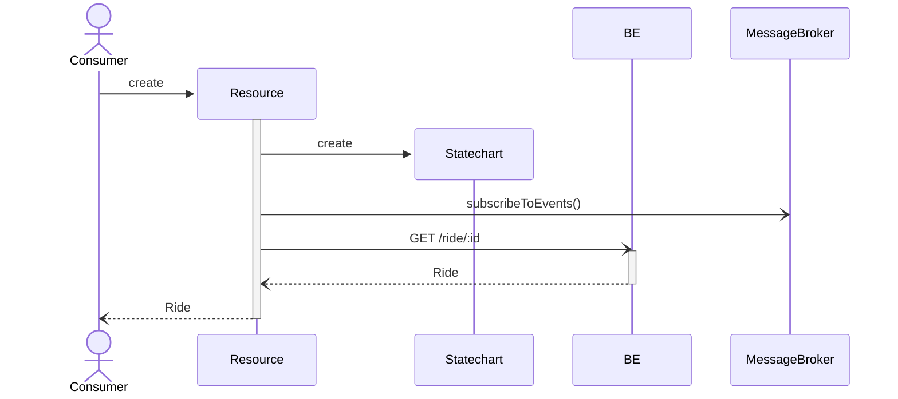
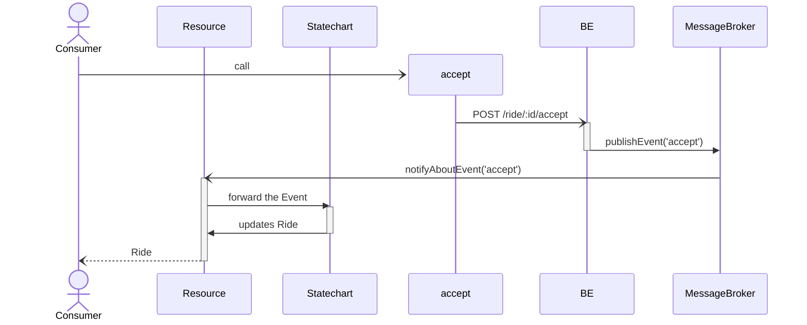
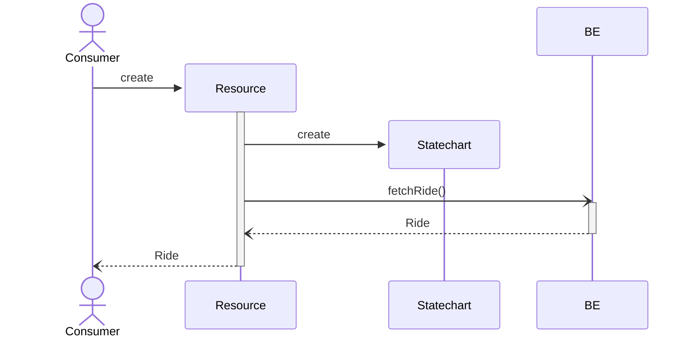
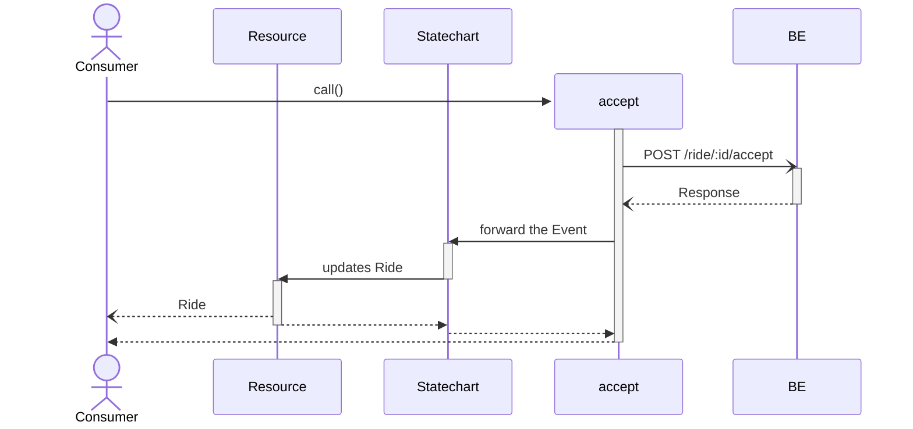

<!-- markdownlint-disable -->

# Scalable Frontend Architecture that meets Your Business

<div class="absolute bottom-10">
  <span class="font-700">
    Thomas Gossmann - <a href="https://gos.si" target="_blank">gos.si</a>
  </span>
</div>

---
layout: center
---

# Architecture


Architects: Draw the Map<br>
Engineers: Read the Map to reach the Goal

---

# Quiz: What does this Product do? (1)


---

# Quiz: What does this Product do? (2)


---

# Quiz: What does this Product do? (3)


---

# Why ?

- Good onboarding to the framework
- Explains technical aspects of the framework

&nbsp;

- Good for hobby and weekend projects
- Hardly scalable beyond that

---
layout: section
---

# Meet Your Business

## Tactical Design

---
layout: two-cols
---

# Technical Objects

- Components
- Services
- Components


<ph-arrow-elbow-left-up/> _not_ aspects of your product

::right::

# Domain Objects

- Contract
- Appointment
- Risk Audit
- Saloon
- Calendar

<ph-arrow-elbow-left-up/> they **are** aspects of your product

---

# Why ?

It is hard to do. Some observed reasons:

1. Education: Data Structures, Algorithms, Design Patterns, Performance, ...
   - Missing: Linguistic Course, Domain-Driven Design Pratices
2. We design development workflows for technical aspects
3. No visibility for the domain in our code
   - Lack of feedback from product people or designers
   - No reward to engineers for their contributing impact

---
layout: statement
---

# Can we (Re)Design our Development Workflow with the Business in Mind?

---
layout: section
---

# 1. Identify Technical Aspects that Encode Business Logic

---
layout: two-cols-header
---

# Presentation Logic / Control Flow (Queries 1)

queries, abilities, questions, criteria

<p class="text-align-center">
  <ph-arrow-elbow-left-down/>
  Two Times Business Logic. Two Times Anti-Patterns
  <ph-arrow-elbow-right-down/>
</p>

::left::

## Helper

```gts
{{#if (feature 'PROPLUS')}}
  Special Feature here
{{/if}}
```

<ul class="absolute left-30px bottom-30px w-100">
  <li> What's the name of the feature?<br>
  hint: it is not "Pro Plus", that's only the
  feature flag currently used for its condition</li>
  <li>Not unit testable :(</li>
</ul>

::right::

## Components

```gts
import Component from '@glimmmer/component';
import { service } from '@ember/service';
import type FeaturesService from 'whereever/features-infra-sits';

class Search extends Component {
  @service declare features: FeaturesService;

  get isProPlus() {
    return this.features.has('PROPLUS');
  }

  <template>
    {{#if this.isPropPlus}}
      Special Feature here
    {{/if}}
  </template>
}
```

---

# Data Fetching (Queries 2)

- Fetching data from your API
- Business logic part:
  - Endpoint
  - Parameters
  - Payload structure

---
layout: two-cols-header
---

# Actions (or Commands)

Causing side-effects

::left::

## Components

```gts
import Component from '@glimmer/component';
import { action } from '@ember/object'; 
import { AnotherComponent } from 'your-ui';

class Expose extends Component {
  @action
  onClick() {
    // whatever happens here
  }

  <template>
    <AnotherComponent @onClick={{this.onClick}}>
      Something sits here
    </AnotherComponent>
  </template>
}
```

::right::

## Services

```ts
import Service from '@ember/service';

class UserService extends Service {
  createUser(data) {
    // ...
  }

  deleteUser(userId: number) {
    // ...
  }
}
```

---

# Services

> Services is an overloaded Term
>
> \- who

<br>
<div class="grid grid-cols-[1fr_1fr_1fr]">
  <div>
    <h2>Infrastructure Services</h2><br>
    <ul>
      <li>API client</li>
      <li>Messaging / Message Broker</li>
    </ul>
  </div>
  <div>
    <h2>Application Services</h2><br>
    <ul>
      <li>Session</li>
      <li>Features</li>
      <li>A/B Testing</li>
    </ul>
  </div>
  <div>
    <h2>Domain Services</h2><br>
    <ul>
      <li>Domain Objects (CRUD)</li>
      <li>e.g. UsersService</li>
    </ul>
  </div>
</div>


We use Components, Services, Routes, Controllers, Models merely to use Ember's
DI system.

---
layout: two-cols-header
---

# What is the correct Statement?

::left::

(A) Make a Framework a Dependency of your Business?

::right::

(B) Use a Framework to Realize your Business?

---
layout: section
---

# 2. (Re)Design our Development Workflow

---
layout: two-cols-header
---

# Rideshare Example

::left::

## On the Development of Reactive Systems with Ember.js

<br>

<Youtube id="bzkYV3AeYm4" />

by Clemens Müller and Michael Klein

::right::

## Domain Modeling Made Functional

<br>

<Youtube id="2JB1_e5wZmU" />

by Scott Wlaschin


---
layout: two-cols
transition: slide-left
---


::right::

```ts
interface User {
  id: string;
  name: string;
  type: 'rider' | 'driver';
}

type RideState = 
  | 'requested'
  | 'declined'
  | 'awaiting_pickup'
  | 'driving'
  | 'arrived'
  | 'payed'
  | 'canceled';

interface Ride {
  id: string;
  from: string;
  to: string;
  riderId: string;
  driverId: string;
  state: RideState;
}
```

---
layout: two-cols
---

```ts
interface User {
  id: string;
  name: string;
  type: 'rider' | 'driver';
}

type RideState = 
  | 'requested'
  | 'declined'
  | 'awaiting_pickup'
  | 'driving'
  | 'arrived'
  | 'payed'
  | 'canceled';

interface Ride {
  id: string;
  from: string;
  to: string;
  riderId: string;
  driverId: string;
  state: RideState;
}
```

::right::

```ts
// actions
function request(ride: Ride, rider: User): void;
function accept(ride: Ride, driver: User): void;
function drive(ride: Ride, driver: User): void;
function arrive(ride: Ride, driver: User): void;
function pay(ride: Ride, rider: User): void;
function cancel(ride: Ride, user?: User): void;

// guards rsp. abilities
function canRequest(ride: Ride, user: User): boolean;
function canAccept(ride: Ride, user: User): boolean;
function canDrive(ride: Ride, user: User): boolean;
function canDecline(ride: Ride, user: User): boolean;
function canArrive(ride: Ride, user: User): boolean;
function mustPay(ride: Ride, rider: User): boolean;

// questions
function isDriver(user: User): boolean;
function isRider(user: User): boolean;
function isDriverFor(ride: Ride, driver: User): boolean;
function calculateTravelDistance(ride: Ride): number;
```

---
layout: two-cols
---

# Implementation

<br>

## Goal

- Ride Details Page
- Task Based UI
- Domain Code in plain TS
- Thin layer in Ember for DI integration

## Given

- `User` is given as part of `SessionService`
- `APIClient` is our `APIService`

::right::

```gts
import { 
  canAccept, mustPay, 
  accept, pay 
} from 'your-domain';
import { Button } from '@hokulea/ember';

import type { TOC } from '@ember/component/template-only';
import type { Ride } from 'ember-domain';

interface RideActionsSignature {
  Args: {
    ride: Ride;
  }
}

const RideActions: TOC<RideActionsSignature> = <template>
  {{#if (canAccept @ride)}}
    <Button @push={{fn (accept) @ride}}>Accept</Button>
  {{/if}}

  {{#if (mustPay @ride)}}
    <Button @push={{fn (pay) @ride}}>Pay</Button>
  {{/if}}
</template>

export { RideActions };
```

---
layout: section
---

# 2.1. Actions

1. Bi-Directional API, Statechart, Event-Driven Architecture, CQRS/ES
2. Uni-Directional API, Statechart, CRUD
3. Uni-Directional API, CRUD

---

# Implementing Scenario 1

Fire & Forget

```ts
import type { APIClient } from 'infra';

async function accept(ride: Ride, driver: User, { apiClient }: { apiClient: APIClient }): void {
  await apiClient.post(`/ride/${ride.id}/accept`, {
    driverId: driver.id
  });
}
```

<div class="grid grid-cols-2 gap-4">
  <div>
    <p>Implementation to focus on:</p>
    <ul>
      <li>Endpoint</li>
      <li>Parameters</li>
      <li>Payload Structure</li>
    </ul>
  </div>
  <div>
    <p>Additionally to the Domain</p>
    <ul>
      <li>Infrastructure/technically relevant parameters</li>
      <li>Develop against interfaces</li>
      <li>Perfect to mock for testing</li>
    </ul>
  </div>
</div>

<ph-arrow-fat-right/> Ready to write unit tests.

---

# Scenario 1: Setup



---

# Scenario 1: Action



---

# Implementing Scenario 2

Fire & Play BE in FE

````md magic-move
```ts
import type { APIClient } from 'infra';

async function accept(ride: Ride, driver: User, { apiClient }: { apiClient: APIClient }): void {
  await apiClient.post(`/ride/${ride.id}/accept`, {
    driverId: driver.id
  });
}
```

```ts
import type { APIClient } from 'infra';

async function accept(ride: Ride, driver: User, { apiClient }: { apiClient: APIClient, statechart: Statechart }): void {
  await apiClient.post(`/ride/${ride.id}/accept`, {
    driverId: driver.id
  });
}
```

```ts
import type { APIClient } from 'infra';

async function accept(ride: Ride, driver: User, { apiClient }: { apiClient: APIClient, statechart: Statechart }): void {
  const response = await apiClient.post(`/ride/${ride.id}/accept`, {
    driverId: driver.id
  });

  statechart.send('accept', response);
}
```

```ts
import type { APIClient } from 'infra';

async function accept(ride: Ride, driver: User, { apiClient }: { apiClient: APIClient, statechart: Statechart }): void {
  const response = await apiClient.post(`/ride/${ride.id}/accept`, {
    driverId: driver.id
  });

  statechart.send('accept', response);
}
```
````

---

# Scenario 2: Setup



---

# Secnarion 2: Action



---

# Implementing Scenario 3

Fire & Play BE in FE

````md magic-move
```ts
import type { APIClient } from 'infra';

async function accept(ride: Ride, driver: User, { apiClient }: { apiClient: APIClient }): void {
  await apiClient.post(`/ride/${ride.id}/accept`, {
    driverId: driver.id
  });
}
```

```ts
import type { APIClient } from 'infra';

async function accept(ride: Ride, driver: User, { apiClient }: { apiClient: APIClient }): void {
  const response = await apiClient.post(`/ride/${ride.id}/accept`, {
    driverId: driver.id
  });

  ride.state = response.state;
}
```
````

---
layout: section
---

# 2.2. Abilities

```ts
function canAccept(ride: Ride, user: User) {
  return ride.state === 'requested' && isDriver(user);
}
```

---
layout: section
---

# 2.3. Integration with Ember

---
layout: two-cols
---

# Abilities

```ts
function canAccept(ride: Ride, user: User) {
  return ride.state === 'requested' && isDriver(user);
}
```

<p class="text-center"><ph-arrow-down/></p>
<p class="text-center"><ph-question-mark/></p>
<p class="text-center"><ph-arrow-down/></p>

```gts
{{#if (canAccept @ride)}}
  ...
{{/if}}
```

::right::

# Actions

```ts
import type { APIClient } from 'infra';

async function accept(ride: Ride, driver: User, { apiClient }: { apiClient: APIClient }): void {
  await apiClient.post(`/ride/${ride.id}/accept`, {
    driverId: driver.id
  });
}
```

<p class="text-center"><ph-arrow-down/></p>
<p class="text-center"><ph-question-mark/></p>
<p class="text-center"><ph-arrow-down/></p>

```gts
<Button @push={{fn (accept) @ride}}>Accept</Button>
```

---

# Abilities: `ember-ability`

````md magic-move
```ts
import { canAccept as upstreamCanAccept } from 'your-plain-ts-domain';
import { ability } from 'ember-ability';

const canAccept = ability((owner) => (ride: Ride) => {
  const session = owner.lookup('service:session');
  const { user } = session;

  return upstreamCanAccept(ride, user);
});

export { canAccept };
```

```ts
import { canAccept as upstreamCanAccept } from 'your-plain-ts-domain';
import { ability } from 'ember-ability';

const canAccept = ability((owner) => (ride: Ride) => {
  const { session } = owner.services;
  const { user } = session;

  return upstreamCanAccept(ride, user);
});

export { canAccept };
```

```ts
import { canAccept as upstreamCanAccept } from 'your-plain-ts-domain';
import { ability } from 'ember-ability';

const canAccept = ability(({ services }) => (ride: Ride) => {
  const { session } = services;
  const { user } = session;

  return upstreamCanAccept(ride, user);
});

export { canAccept };
```
````

<div class="absolute top-50 right-5">
<code>ember-sweet-owner</code>

```ts
import { sweetenOwner } from 'ember-sweet-owner';

const { services } = sweetenOwner(owner);
const { session } = services;
```
</div>

<p class="text-center w50%"><ph-arrow-down/></p>

```gts
{{#if (canAccept @ride)}}
  ...
{{/if}}
```

---

# Actions: `ember-command`

```ts
import { accept as upstreamAccept } from 'your-plain-ts-domain';
import { action } from 'ember-command';

const accept = action(({ services }) => (ride: Ride) => {
  const { session, api } = services;
  const { user } = session;

  return upstreamAccept(ride, user, { apiClient: api });
});

export { canAccept };
```

<p class="text-center w50%"><ph-arrow-down/></p>

```gts
<Button @push={{fn (accept) @ride}}>Accept</Button>
```

---

# Domain Code

- is tiny (only a handful lines of code)
- easy unit testing
- thin integration layer into your framework

but:

- is still hard to write code like that
- that's a naive design
- needs visibility
- reward engineers